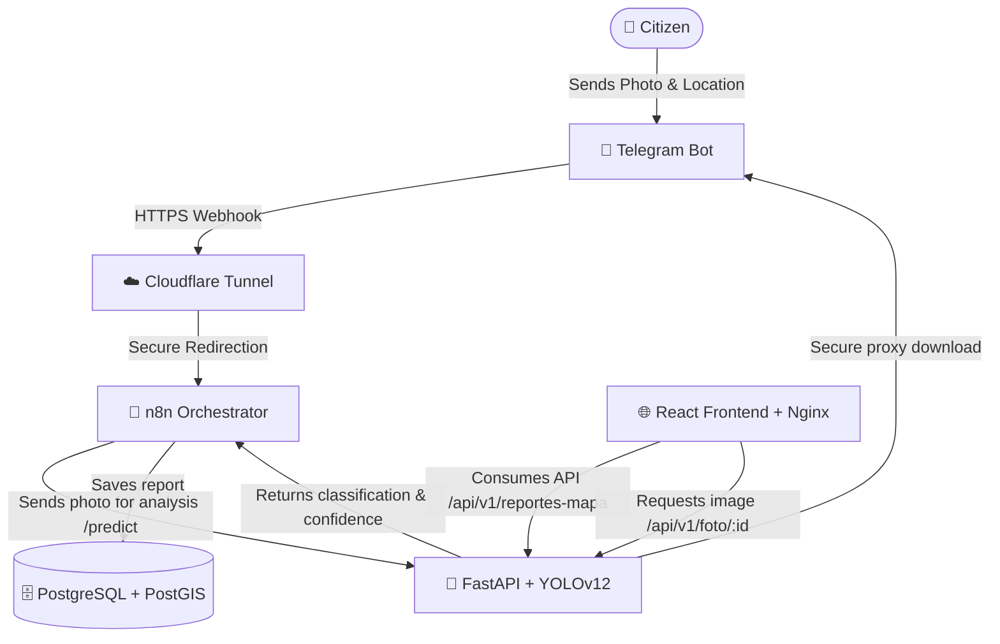

# 👁️ Vision Qro

> **Intelligent Citizen Monitoring and Waste/Incident Classification System using AI**

**Vision Qro** is a comprehensive technology platform designed to improve urban management in Querétaro. It allows citizens to instantly report issues (such as organic/inorganic waste, trash bags, or potholes) through a **Telegram Bot**. The system autonomously processes the reported images using a **YOLOv12 AI model** to classify the type of waste or incident, stores the geospatial location in a **PostgreSQL + PostGIS** database, and visualizes all reports in real time on a **3D interactive web map** powered by **Mapbox GL**.

---

## 🏗️ System Architecture

The project is designed under a modular and containerized architecture using **Docker**, facilitating easy deployment and scalability.



Both the **Backend services** and the **React Dashboard** are compiled and run within the containerized stack, simplifying production installation and configuration on edge devices.

---

## 🛠️ Tech Stack

### 📱 Report Ingestion
- **Telegram Bot API**: Conversational user interface for fast submission of reports (GPS coordinates and photos).

### 🔄 Integration & Orchestration
- **n8n**: Workflow orchestrator that receives Telegram webhooks, coordinates AI analysis, and handles database persistence.
- **Cloudflare Tunnels (`cloudflared`)**: Safely exposes the local n8n webhook to the internet without opening router ports.

### 🧠 Backend & Artificial Intelligence
- **FastAPI**: High-performance asynchronous web framework for Python.
- **Ultralytics YOLOv12 (`yolo12n.pt`)**: State-of-the-art computer vision model for real-time object detection and automated classification, optimized for Jetson Orin.
- **Pillow**: In-memory image processing and optimization.
- **Databases & asyncpg**: Asynchronous clients for efficient PostgreSQL database connection.

### 🗄️ Database
- **PostgreSQL 15**: Relational database engine.
- **PostGIS 3.4**: Spatial database extension for storing and performing efficient geographic queries on reports.

### 🌐 Frontend (Monitoring Dashboard)
- **React 19 & Vite**: Modern UI library and ultra-fast bundler.
- **Dockerized with Nginx**: Multi-stage production container configuration with gzip compression and routing support.
- **Tailwind CSS v4.0**: Modern utility-first responsive styling.
- **Mapbox GL & react-map-gl**: High-definition 3D interactive vector map rendering.
- **Framer Motion**: Smooth micro-animations and polished interface transitions.
- **Lucide React**: Consistent vector icon set.

---

## 🗃️ Database Schema

The schema is defined in the `init.sql` file and initializes automatically when booting the Docker containers:

```sql
-- Enable PostGIS spatial extension
CREATE EXTENSION IF NOT EXISTS postgis;

-- Main citizen reports table
CREATE TABLE IF NOT EXISTS reportes (
    id                SERIAL PRIMARY KEY,
    latitud           DOUBLE PRECISION,   -- Nullable (stores as n8n collects workflow state)
    longitud          DOUBLE PRECISION,   -- Nullable
    clase_corregida   VARCHAR(100),       -- Class detected by AI or corrected by user
    subclase          VARCHAR(100),       -- Simplified category (org, inorg, bache, bolsa, otro)
    confianza         DOUBLE PRECISION,   -- AI model confidence percentage
    descripcion       TEXT,               -- Optional description/comment
    foto_url          TEXT,               -- Photo path/ID on Telegram servers
    telegram_user_id  BIGINT,             -- Telegram user ID
    telegram_username VARCHAR(100),       -- Sender's Telegram username
    chat_id           BIGINT,             -- Telegram chat ID for conversational states
    foto_id           TEXT,               -- Photo ID
    estado            VARCHAR(50),        -- Report validation state
    created_at        TIMESTAMPTZ DEFAULT NOW()
);

-- Optimized indexes for spatial queries and history tracking
CREATE INDEX IF NOT EXISTS idx_reportes_coords ON reportes (latitud, longitud);
CREATE INDEX IF NOT EXISTS idx_reportes_fecha ON reportes (created_at DESC);
```

---

## ✨ Features Added in Production

### 🗑️ "Bolsa de basura" (Trash Bag) Category
A dedicated category has been implemented to track garbage bags left on streets. It is fully integrated into the database schema, n8n conversational rules, and visual interfaces. On the dashboard map, trash bags are highlighted with a distinct **purple** (`#8b5cf6`) marker and filter.

### 🚗 Unified Pothole UI
Visual visualization of potholes on the Mapbox layer has been unified. Pothole subclass labels (small `p`, medium `m`, and large `g`) are rendered using a consistent **red** (`#ef4444`) color to prioritize visual clarity for public maintenance teams.

### 🔒 Secure Admin Session & Authentication
Dashboard entry has been protected to ensure data security. 
- **Secure Authentication:** FastAPI handles a `POST /api/v1/auth` request checking credentials against `ADMIN_PASSWORD`.
- **API Key Header Validation:** Protected operations like deleting reports and exporting CSV require a valid `X-API-Key` token sent in the headers, securing endpoints against unauthenticated scripts.

### 📊 CSV Data Export & Archiving
Admins can export the database query history directly from the dashboard map by clicking the download icon. The backend generates and streams a CSV archive file (`reportes_vision_qro.csv`), facilitating monthly backups and local statistical analysis.

---

## ⚙️ Production Hardening & Operations

### 🐳 Container Log Rotation
To prevent the Jetson Orin Nano's storage from filling up with container logs, all Docker services are configured with log rotation:
```yaml
logging:
  driver: "json-file"
  options:
    max-size: "10m"
    max-file: "3"
```
This restricts logs for each container to a maximum of 3 files of 10MB each.

### 🧹 n8n Workflow Run Pruning
n8n is configured to automatically prune its execution database. It only retains a history of executions for 7 days (`168` hours), keeping n8n's internal storage footprints minimal:
```env
EXECUTIONS_DATA_PRUNE=true
EXECUTIONS_DATA_MAX_AGE=168
EXECUTIONS_DATA_PRUNE_TIMEOUT=3600
```

### ⚡ Jetson Orin GPU Acceleration
The AI microservice (`ai_brain`) uses the official `dustynv/pytorch:2.7-r36.4.0` image as its base, ensuring direct compatibility with the Jetson Orin CUDA drivers. Access to the GPU is booked in the compose stack under `deploy.resources.reservations`.

### 🗄️ Automated Database Backups
A database backup script is located in `utils/backup_db.sh`. It runs a compressed `pg_dump` of the spatial database, saves it in `backups/`, and automatically prunes backups older than 30 days.

It is recommended to run this script as a daily cron job. To configure it:
```bash
# Open crontab configuration
crontab -e

# Add the following line to execute the backup every day at 3:00 AM:
0 3 * * * /home/jetson/Vision_Qro/utils/backup_db.sh >> /home/jetson/Vision_Qro/backups/backup.log 2>&1
```

### 📡 Dynamic Host Resolution
The frontend's network request target dynamically adapts to `window.location.hostname` instead of being locked to a local `localhost` IP. This allows multiple operators in the local network to connect directly to the dashboard hosted on the Jetson Orin Nano's IP address.

---

## 🚀 Installation & Deployment Guide

### Prerequisites
- **Docker** and **Docker Compose** installed on your Jetson.
- A **Telegram Bot** token (created via [@BotFather](https://t.me/BotFather)).
- A **Mapbox** token (obtained for free at [Mapbox](https://www.mapbox.com/)).
- A **Cloudflare Tunnel** token to map n8n webhooks securely.

---

### 1. Environment Variables Setup

#### Backend (`/vision_qro_backend/.env`):
Create a `.env` file in the backend directory based on the following template:
```env
POSTGRES_USER=your_db_user
POSTGRES_PASSWORD=your_db_password
POSTGRES_DB=vision_qro

# Telegram Configuration
TELEGRAM_BOT_TOKEN=1234567890:ABCdefGhIJKlmNoPQRsTUVwxyZ

# Public Webhook URL (Cloudflare or custom domain with SSL)
WEBHOOK_URL=https://your-domain-or-tunnel.cf/webhooks/telegram

# Cloudflare Tunnel Token
CLOUDFLARE_TUNNEL_TOKEN=your_cloudflare_tunnel_token

# CORS Origins (Allowed Frontend URL)
CORS_ORIGINS=http://localhost:5173,http://127.0.0.1:5173

# Admin Security Setup
ADMIN_PASSWORD=your_secure_admin_password
API_KEY=your_secure_api_key_token
```

#### Frontend (`/vision-qro-frontend/.env.local`):
Create a `.env.local` file in the frontend directory for local development:
```env
VITE_MAPBOX_TOKEN=your_mapbox_token_here
VITE_API_URL=http://localhost:8000
```

---

### 2. Run the Services (Docker Compose)

Navigate to the backend directory and build/spin up the services:
```bash
cd vision_qro_backend
docker compose up --build -d
```
This builds and launches:
- **`vision_qro_db`**: Database (PostgreSQL/PostGIS) running internally.
- **`vision_qro_n8n`**: Workflow engine at `http://localhost:5678`.
- **`vision_qro_ai`**: FastAPI AI Brain running at `http://localhost:8000`.
- **`vision_qro_tunnel`**: Cloudflare Tunnel mapping the local webhook.
- **`vision_qro_frontend`**: React web dashboard served via Nginx on port `5173`.

Access the web dashboard at `http://<jetson-ip>:5173` or `http://localhost:5173`.

---

### 3. Local Frontend Development (Optional)

If you need to make changes to the dashboard code and run a local hot-reloading development server:
```bash
cd vision-qro-frontend
npm install
npm run dev
```
The development server will launch at `http://localhost:5173` pointing to your backend configurations.

---

## 🔒 Security & Data Integrity

- **Token Safety**: The frontend requests images through `/api/v1/foto/{id}` instead of querying Telegram's API directly. The FastAPI server acts as a secure proxy, leveraging the server-side `TELEGRAM_BOT_TOKEN`.
- **SQL Injection Prevention**: Safe parameter-binding queries are enforced via the Python `databases` library.
- **Strict CORS Policy & Headers**: Access headers are validated dynamically, restricting API ingestion exclusively to verified clients.
