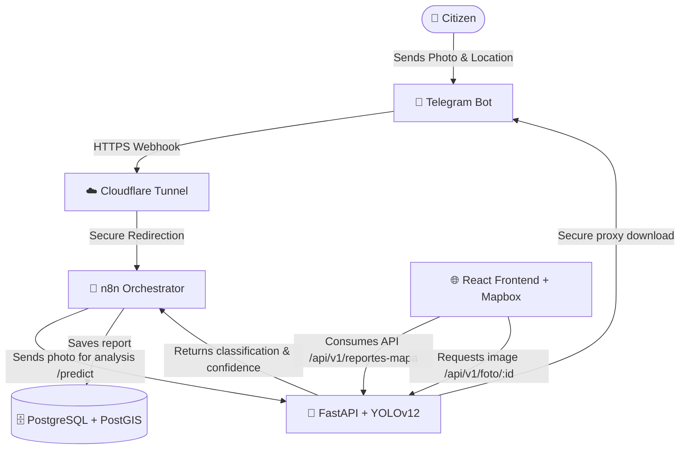

# 👁️ Vision Qro

> **Intelligent Citizen Monitoring and Waste/Incident Classification System using AI**

**Vision Qro** is a comprehensive technology platform designed to improve urban management in Querétaro. It allows citizens to instantly report issues (such as organic/inorganic waste in public spaces or potholes) through a **Telegram Bot**. The system autonomously processes the reported images using a **YOLOv12 AI model** to classify the type of waste or incident, stores the geospatial location in a **PostgreSQL + PostGIS** database, and visualizes all reports in real time on a **3D interactive web map** powered by **Mapbox GL**.

---

## 🏗️ System Architecture

The project is designed under a modular and containerized architecture using **Docker**, facilitating easy deployment and scalability.



---

## 🛠️ Tech Stack

### 📱 Report Ingestion
- **Telegram Bot API**: Conversational user interface for fast submission of reports (GPS coordinates and photos).

### 🔄 Integration & Orchestration
- **n8n**: Workflow orchestrator that receives Telegram webhooks, coordinates AI analysis, and handles database persistence.
- **Cloudflare Tunnels (`cloudflared`)**: Safely exposes the local n8n webhook to the internet without opening router ports.

### 🧠 Backend & Artificial Intelligence
- **FastAPI**: High-performance asynchronous web framework for Python.
- **Ultralytics YOLOv12 (`yolo12n.pt`)**: State-of-the-art computer vision model for real-time object detection and automated classification.
- **Pillow**: In-memory image processing and optimization.
- **Databases & asyncpg**: Asynchronous clients for efficient PostgreSQL database connection.

### 🗄️ Database
- **PostgreSQL 15**: Relational database engine.
- **PostGIS 3.4**: Spatial database extension for storing and performing efficient geographic queries on reports.

### 🌐 Frontend (Monitoring Dashboard)
- **React 19 & Vite**: Modern UI library and ultra-fast bundler.
- **Tailwind CSS v4.0**: Modern utility-first responsive styling.
- **Mapbox GL & react-map-gl**: High-definition 3D interactive vector map rendering.
- **Framer Motion**: Smooth micro-animations and polished interface transitions.
- **Lucide React**: Consistent vector icon set.

---

## 🗃️ Database Schema

The schema is defined in the `init.sql` file and initializes automatically when booting the Docker containers:

```sql
-- Enable PostGIS spatial extension
CREATE EXTENSION IF NOT EXISTS postgis;

-- Main citizen reports table
CREATE TABLE IF NOT EXISTS reportes (
    id                SERIAL PRIMARY KEY,
    latitud           DOUBLE PRECISION NOT NULL,
    longitud          DOUBLE PRECISION NOT NULL,
    clase_corregida   VARCHAR(100),       -- Class detected by AI (e.g. bottle, apple)
    subclase          VARCHAR(100),       -- Simplified category (org, inorg, bache)
    confianza         DOUBLE PRECISION,   -- AI model confidence percentage
    descripcion       TEXT,               -- Optional description/comment
    foto_url          TEXT,               -- Photo path/ID on Telegram servers
    telegram_user_id  BIGINT,             -- Telegram user ID
    telegram_username VARCHAR(100),       -- Sender's Telegram username
    created_at        TIMESTAMPTZ DEFAULT NOW()
);

-- Optimized indexes for spatial queries and history tracking
CREATE INDEX IF NOT EXISTS idx_reportes_coords ON reportes (latitud, longitud);
CREATE INDEX IF NOT EXISTS idx_reportes_fecha ON reportes (created_at DESC);
```

---

## 🔄 Detailed Workflow

1. **Report Capture**: The citizen sends a photograph and shares their live location with the Telegram Bot.
2. **Webhook Handshake**: Telegram triggers a webhook. n8n processes the payload, extracting the GPS coordinates and the image's `file_id`.
3. **AI Prediction**: n8n forwards the image to the `ai_brain` service (`/predict`). The FastAPI API runs inference using YOLOv12:
   - If it detects a mapped class (e.g., `bottle` -> `inorg` or `apple` -> `org`), it classifies the report automatically.
   - If confidence is low or no objects are recognized, the report is marked as **"Pending Classification"**, allowing an operator in the control center to manually categorize it via the web dashboard.
4. **Persistence**: n8n saves the report to PostgreSQL, linking the reporter's Telegram username and location coordinates.
5. **Visualization**: The React frontend displays the reports on the Mapbox map of Querétaro using interactive markers color-coded by category (green for Organic, blue for Inorganic, red for Potholes, and gray for Pending).
6. **File Security**: Photos are served to the frontend using a Secure Proxy endpoint in FastAPI (`/api/v1/foto/{id}`) that communicates with the Telegram API. This ensures the **Telegram bot token is never exposed** in client-side browser requests.

---

## 🚀 Installation & Deployment Guide

### Prerequisites
- **Docker** and **Docker Compose** installed on your system.
- **Node.js** (v18 or higher) and **npm** for local frontend development.
- A **Telegram Bot** token (created via [@BotFather](https://t.me/BotFather)).
- A **Mapbox** token (obtained for free at [Mapbox](https://www.mapbox.com/)).
- A **Cloudflare Tunnel** token for remote webhooks/production (optional for direct local testing).

---

### 1. Environment Variables Setup

#### Backend (`/vision_qro_backend/.env`):
Create a `.env` file in the backend directory based on the following template:
```env
POSTGRES_USER=your_db_user
POSTGRES_PASSWORD=your_db_password
POSTGRES_DB=vision_qro

# Telegram Configuration
TELEGRAM_BOT_TOKEN=1234567890:ABCdefGhIJKlmNoPQRsTUVwxyZ

# Public Webhook URL (Cloudflare or custom domain with SSL)
WEBHOOK_URL=https://your-domain-or-tunnel.cf/webhooks/telegram

# Cloudflare Tunnel Token
CLOUDFLARE_TUNNEL_TOKEN=your_cloudflare_tunnel_token

# CORS Origins (Allowed Frontend URL)
CORS_ORIGINS=http://localhost:5173,http://127.0.0.1:5173
```

#### Frontend (`/vision-qro-frontend/.env.local`):
Create a `.env.local` file in the frontend directory:
```env
VITE_MAPBOX_TOKEN=your_mapbox_token_here
VITE_API_URL=http://localhost:8000
```

---

### 2. Run the Backend (Docker Compose)

Navigate to the backend directory and spin up the services:
```bash
cd vision_qro_backend
docker compose up --build -d
```
This boots:
- **Database (PostgreSQL/PostGIS)** exposed internally.
- **n8n** listening on `http://localhost:5678`.
- **FastAPI AI Brain** running on `http://localhost:8000`.
- **Cloudflare Tunnel** mapping your local n8n instance to the Telegram bot.

---

### 3. Run the Frontend (Local Development)

In a new terminal tab, navigate to the frontend directory, install dependencies, and start the Vite dev server:
```bash
cd vision-qro-frontend
npm install
npm run dev
```
The interactive monitoring dashboard will launch at `http://localhost:5173`.

---

## 🔒 Security & Data Integrity

- **Token Safety**: The frontend requests images through `/api/v1/foto/{id}` instead of querying Telegram's API directly. The FastAPI server acts as a secure proxy, leveraging the server-side `TELEGRAM_BOT_TOKEN`.
- **SQL Injection Prevention**: Safe parameter-binding queries are enforced via the Python `databases` library.
- **Strict CORS Policy**: Granular control over allowed origins prevents unauthorized client requests.
