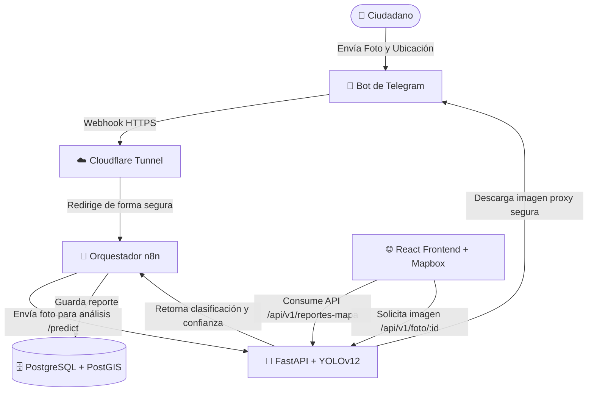

# 👁️ Vision Qro

> **Sistema Inteligente de Monitoreo Ciudadano y Clasificación de Residuos/Incidentes con IA**

**Vision Qro** es una plataforma tecnológica integral diseñada para mejorar la gestión urbana en Querétaro. Permite a los ciudadanos reportar incidencias (como basura orgánica/inorgánica en vía pública o baches) de manera instantánea a través de un **Bot de Telegram**. El sistema procesa de forma autónoma las imágenes reportadas utilizando un **modelo de Inteligencia Artificial YOLOv12** para clasificar el tipo de residuo o incidencia, almacena la ubicación geoespacial en una base de datos **PostgreSQL + PostGIS**, y visualiza todos los reportes en tiempo real en un **mapa interactivo web 3D** impulsado por **Mapbox GL**.

---

## 🏗️ Arquitectura del Sistema

El proyecto está diseñado bajo una arquitectura modular y contenedorizada mediante **Docker**, lo que facilita su despliegue y escalabilidad.



---

## 🛠️ Tecnologías Utilizadas

### 📱 Entrada de Reportes
- **Telegram Bot API**: Interfaz de usuario conversacional para el envío rápido de reportes (coordenadas GPS y fotos).

### 🔄 Integración y Orquestación
- **n8n**: Orquestador de flujos de trabajo que recibe los webhooks de Telegram, coordina el análisis de IA y gestiona la persistencia en la base de datos.
- **Cloudflare Tunnels (`cloudflared`)**: Expone el webhook local de n8n a internet de forma segura sin abrir puertos en el router.

### 🧠 Backend e Inteligencia Artificial
- **FastAPI**: Framework web asíncrono de alto rendimiento para Python.
- **Ultralytics YOLOv12 (`yolo12n.pt`)**: Modelo de visión por computadora de última generación para la detección de objetos y clasificación automatizada.
- **Pillow**: Procesamiento y optimización de imágenes en memoria.
- **Databases & asyncpg**: Cliente asíncrono para interactuar con la base de datos PostgreSQL de forma eficiente.

### 🗄️ Base de Datos
- **PostgreSQL 15**: Motor de base de datos relacional.
- **PostGIS 3.4**: Extensión espacial para almacenar y realizar consultas geográficas eficientes de los reportes.

### 🌐 Frontend (Dashboard de Monitoreo)
- **React 19 & Vite**: Biblioteca de UI moderna y empaquetador ultrarrápido.
- **Tailwind CSS v4.0**: Estilos modernos y responsivos.
- **Mapbox GL & react-map-gl**: Renderizado interactivo de mapas vectoriales en 3D de alta definición.
- **Framer Motion**: Micro-animaciones e interactividad pulida en la interfaz.
- **Lucide React**: Conjunto de iconos vectoriales consistentes.

---

## 🗃️ Esquema de la Base de Datos

El esquema se encuentra definido en el archivo `init.sql` y se inicializa automáticamente al levantar el contenedor de Docker:

```sql
CREATE EXTENSION IF NOT EXISTS postgis;

CREATE TABLE IF NOT EXISTS reportes (
    id                SERIAL PRIMARY KEY,
    latitud           DOUBLE PRECISION NOT NULL,
    longitud          DOUBLE PRECISION NOT NULL,
    clase_corregida   VARCHAR(100),       -- Objeto detectado por la IA (ej. bottle, apple)
    subclase          VARCHAR(100),       -- Categoría simplificada (org, inorg, bache)
    confianza         DOUBLE PRECISION,   -- Porcentaje de confianza del modelo IA
    descripcion       TEXT,               -- Comentario opcional
    foto_url          TEXT,               -- Ruta/ID de la foto en los servidores de Telegram
    telegram_user_id  BIGINT,             -- ID del usuario de Telegram
    telegram_username VARCHAR(100),       -- Nombre de usuario del reportante
    created_at        TIMESTAMPTZ DEFAULT NOW()
);

-- Índices optimizados para búsquedas espaciales e historial
CREATE INDEX IF NOT EXISTS idx_reportes_coords ON reportes (latitud, longitud);
CREATE INDEX IF NOT EXISTS idx_reportes_fecha ON reportes (created_at DESC);
```

---

## 🔄 Flujo de Trabajo Detallado

1. **Captura de Reporte**: El ciudadano envía una fotografía y comparte su ubicación en tiempo real al Bot de Telegram.
2. **Recepción en n8n**: Telegram dispara un webhook. n8n procesa la carga y extrae las coordenadas espaciales y el `file_id` de la imagen.
3. **Predicción con IA**: n8n envía la imagen al servicio `ai_brain` (`/predict`). La API de FastAPI ejecuta la inferencia con YOLOv12:
   - Si detecta un objeto mapeado (por ejemplo, `bottle` -> `inorg` o `apple` -> `org`), clasifica el reporte automáticamente.
   - Si la confianza es baja o no detecta objetos, el reporte se marca como **"Pendiente de Clasificación"**, permitiendo que un operador del centro de control lo categorice manualmente desde la interfaz web.
4. **Persistencia**: n8n guarda el reporte en PostgreSQL, asociando los metadatos del usuario de Telegram (username) y las coordenadas geográficas.
5. **Visualización y Gestión**: El frontend de React muestra los reportes en el mapa de Mapbox de Querétaro utilizando marcadores interactivos agrupados y estilizados por tipo (verde para Orgánico, azul para Inorgánico, rojo para Baches y gris para Pendiente). 
6. **Seguridad de Archivos**: Las fotos se sirven en el frontend mediante un endpoint Proxy en FastAPI (`/api/v1/foto/{id}`) que se comunica con la API de Telegram, asegurando que el **token del bot nunca sea expuesto** en las peticiones del navegador cliente.

---

## 🚀 Guía de Instalación y Despliegue

### Requisitos Previos
- **Docker** y **Docker Compose** instalados en el sistema.
- **Node.js** (v18 o superior) y **npm** para levantar el desarrollo local de frontend.
- Un token de **Telegram Bot** (creado vía [@BotFather](https://t.me/BotFather)).
- Un token de **Mapbox** (obtenido gratuitamente en [Mapbox](https://www.mapbox.com/)).
- Un token de túnel de **Cloudflare** para producción/pruebas remotas (opcional para desarrollo local directo).

---

### 1. Configuración de Variables de Entorno

#### Backend (`/vision_qro_backend/.env`):
Crea un archivo `.env` en la carpeta del backend basándote en la siguiente plantilla:
```env
POSTGRES_USER=tu_usuario_db
POSTGRES_PASSWORD=tu_contrasena_db
POSTGRES_DB=vision_qro

# Configuración de Telegram
TELEGRAM_BOT_TOKEN=1234567890:ABCdefGhIJKlmNoPQRsTUVwxyZ

# URL Pública de Webhook (Cloudflare o dominio propio con SSL)
WEBHOOK_URL=https://tu-dominio-o-tunel.cf/webhooks/telegram

# Token de Cloudflare Tunnel
CLOUDFLARE_TUNNEL_TOKEN=tu_token_de_tunel_cloudflare

# CORS (Orígenes permitidos para el Frontend)
CORS_ORIGINS=http://localhost:5173,http://127.0.0.1:5173
```

#### Frontend (`/vision-qro-frontend/.env.local`):
Crea un archivo `.env.local` en la carpeta del frontend:
```env
VITE_MAPBOX_TOKEN=tu_token_de_mapbox_aqui
VITE_API_URL=http://localhost:8000
```

---

### 2. Ejecutar el Backend (Docker Compose)

En la raíz del proyecto, navega a la carpeta de backend y levanta los servicios:
```bash
cd vision_qro_backend
docker compose up --build -d
```
Esto iniciará:
- **Base de Datos (PostgreSQL/PostGIS)** expuesta internamente.
- **n8n** en `http://localhost:5678`.
- **FastAPI AI Brain** en `http://localhost:8000`.
- **Cloudflare Tunnel** para enlazar tu n8n con el bot de Telegram.

---

### 3. Ejecutar el Frontend (Desarrollo Local)

En una nueva terminal, ve a la carpeta del frontend, instala las dependencias e inicia el servidor de desarrollo Vite:
```bash
cd vision-qro-frontend
npm install
npm run dev
```
La aplicación web interactiva se abrirá automáticamente en `http://localhost:5173`.

---

## 🔒 Seguridad e Integridad de Datos

- **Token Oculto**: El frontend realiza peticiones de imágenes a `/api/v1/foto/{id}` en lugar de interactuar directamente con Telegram. El servidor FastAPI actúa como intermediario seguro empleando el `TELEGRAM_BOT_TOKEN` almacenado en las variables de entorno del servidor.
- **Consultas SQL Seguras**: Uso de placeholders paramétricos en FastAPI (a través del paquete `databases`) para mitigar cualquier riesgo de inyección SQL.
- **Políticas CORS Strict**: Configuración granular de orígenes permitidos en la API para evitar peticiones no autorizadas de terceros.
